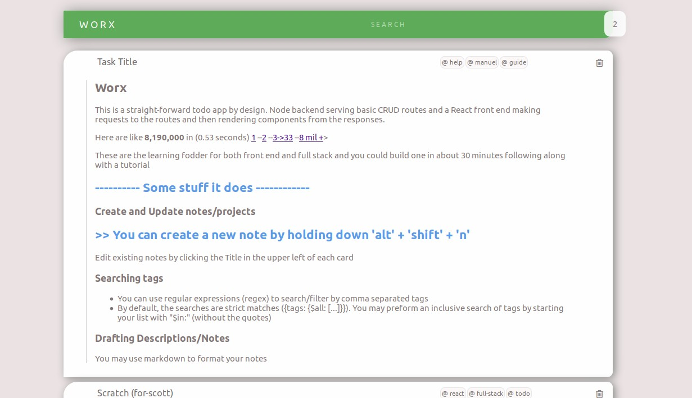
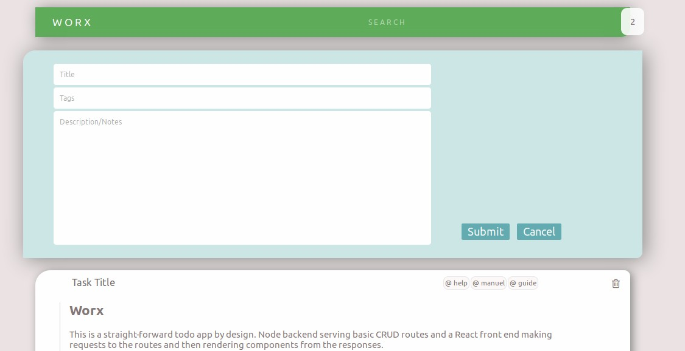
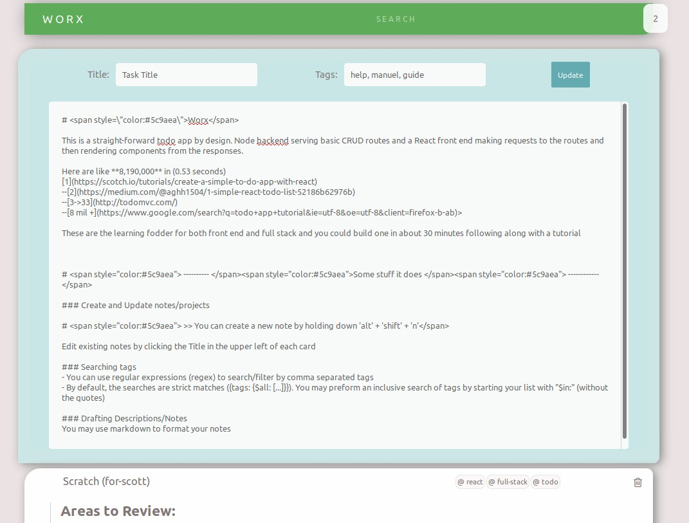

# W O R X
### Submission for Valley Hackathon

## Note Resource Organizing/Note Taking Application

  - Markdown compiler for card body
  - Searchable tag elements
  - sorted by most recent update/creation
  - Built with React front-end and Node.js (Express) back-end
  - consumes RESTful API: Index, Create, Show, Update, Destroy

### Hold "Alt" + "Shift" + "n" for new card form

### Click on card title to update a card

